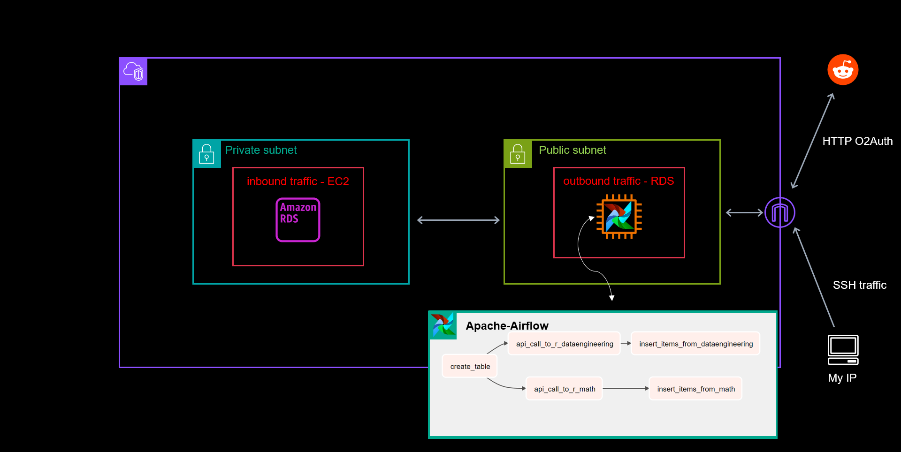

# Cloud Native Reddit ETL Pipeline using Airflow
In this project, we build a data pipeline which extracts data from various subreddits using the reddit API, transforms the extracted data into a structured format, and load the result into an MySQL database on RDS. Each of these tasks is scheduled to run on a daily interval in Airflow, and is executed on an EC2 instance. Multiple layers of security are implemented throughout the project. The following is a diagram showing the infastructure of the final product. 



We now provide detailed instructions to reproduce this project. These instructions assume one already has an aws account setup. The file structure in this repo is met to mimic the final structure of an EC2 instance after the steps below are followed. 

## Step 1: Creating the EC2 Instance
- In the aws EC2 console, launch a new instance using the quickstart __Ubuntu AMI__. 
- For size, since we'll be running airflow which requires at least two gigs of RAM, we'll use __t2.medium__. Please note that this is not in the Free tier.
- Be sure to create a new key pair using the default options, and save it in your project's root directory.
- Under security groups, only allowing __SSH traffic__ is neccesary. For the purpose of added security, only allow it from your IP.
- __(optional)__ Since this pipeline executes short jobs, once a day, and those jobs can be interrupted, this is a use case for spot instances. If you're familiar with these, request a spot instance. 
- Finally, click on launch instance. 

## Step 2: Setting up MySQL on RDS connected to your EC2 Instance with Airflow
- In the aws RDS console, create a new database.
- Name it whatever you'd like, and select __MySQL__ for the engine, and select __free_tier__ under templates.
- Under settings, name your RDS instance and create a username and password. __Make sure you save this username and password, as we will need it in Step 5 below.__
- Scroll down to __Connectivity__, and select __Connect to an EC2 compute resource__. Select the instance you just created. This will place the database and instance in the same VPC, and will allow inbound traffic from the instance to the database. 
- Scroll down to __Additional Configuration__ at the bottom, and enter an initial database name. __Make sure you save this database name, as we will need it in Step 5 below__.
- Wait a few minutes for your database to launch. Once launched, click on the database, and under __Connectivity & security__, copy/paste the __Endpoint__. Save this endpoint somewhere, as we will need it in Step 5.  


## Step 3: SSH into and setup your EC2 Instance
- Navigate to the EC2 console, and click on __Connect__
- In the "SSH client tag" section, click __copy__ at the bottom. This copies the command to ssh into your EC2 instance, using the key-pair name. 
- Navigate to the root directory of your project. In your command line, type `chmod 0600 <your_key_pair_file_name>`.
- paste the shh command you copied previously and hit enter. You should now be in your EC2 instance. 
- From ~, recreate the __bootstrap.sh__ file by typing `nano bootstrap.sh` and copy/paste-ing the bootstrap.sh file found in this repository.  
- Run this script using `./bootstrap.sh`. If needed, add execute permssions first using `chmod +x bootstrap.sh`.

## Step 4: Creating your __config.py__ file
- This project pulls data from reddit using their api. To set this up, you need to set up an app using OAuth2. To do so, follow the instructions [here](https://github.com/reddit-archive/reddit/wiki/OAuth2). A great in depth tutorial can be found [here](https://www.jcchouinard.com/reddit-api/). On the "create a reddit application" page, do the following:
    - copy/paste the string in the top left under "personal use script" and save it for later use. This is your __Client ID__. 
    - copy/paste the __secret__ and save it for later use.

- Finish creating the app, and make sure you have the username and password associated with your reddit account, as well as the RDS username, password, initial database name, and rds api key from the previous step.
- Using the above information, create a __config.py__ file that should look something like this:
    ```
    api_key =  "your_copy_pasted_string_under_personal_use_script"
    api_secret = "your_copy_pasted_secret_token"

    username = "your_reddit_username"
    password = "your_reddit_password"
    botname = "short_description_of_your_app"

    rds_user = "your_rds_username"
    rds_password = "your_rds_password"
    rds_db_name = "your_initial_database_name"
    rds_endpoint = "your_rds_endpoint"

    ```

## Step 5: Setting up the Dag
- Navigate to ~/airflow/dags and type `nano config.py` and copy/paste the file created in the previous step.
- __(optional)__ To make sure your connection to the MySQL database is working properly, type `nano test_connection.py` and copy/paste the file of the same name from this directory into the editor. Run it using `python3 test_connection.py`
- type `nano reddit-etl.py` and copy/paste the file of the same name from this directory into the editor.

## Step 6: Running the Dag
- Make sure you're in the dags folder for this step.
- type `nano airflow_commands.sh` and copy/paste the file of the same name from this repo.
type `chmod +x airflow_commands.sh` so you can execute it.
- Finally, run `./airflow_commands.sh`
- As long as the start date of the dag is before the current date, the dag should begin running. 
To check if the dag has run, type `nano test.py` and copy/paste the file of the same name from this repo. Similarly for `nano check_airflow_run.sh`, adding execution permissions using chmod +x. 
- run `./check_airflow_run.sh`. This should return the status of the dag job, as well as the the titles of some reddit posts, and the size of the database. 
- Note: if you closed your terminal throughout the steps, you may want to "re-hide" the example dags that come with airflow by either typing  `export AIRFLOW__CORE__LOAD_EXAMPLES=False` in the terminal, or changing the airflow.cfg file directly. 


